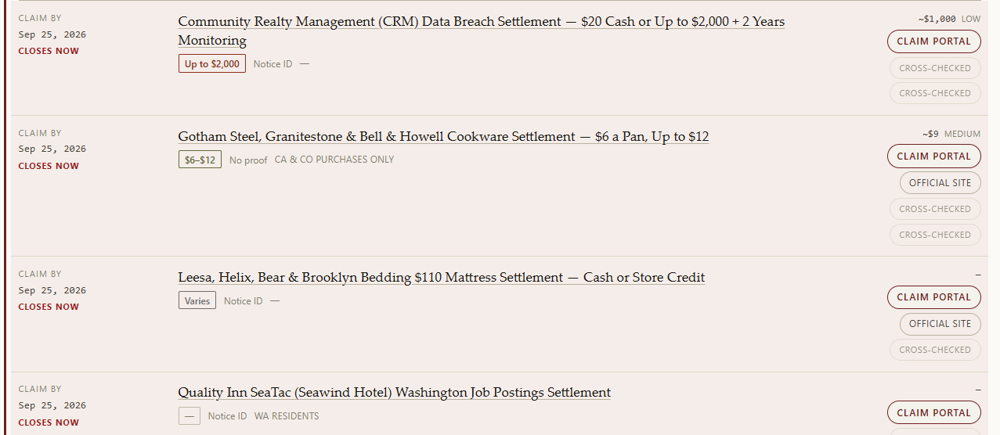
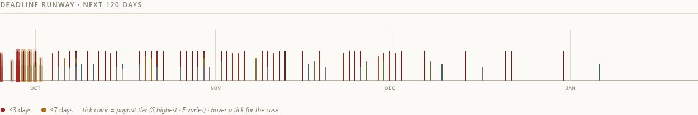

# KnowYourClassAction

**Most class-action trackers show you the maximum payout. This one shows the
realistic one, the proof you actually need, and the exact deadline.**

A free, self-updating tracker for US class-action settlements — **[see it
live](https://chickenman67.github.io/KnowYourClassAction/)** — split by **how big
the money is**, **what it takes to claim it**, and **when the window closes**.
Not legal advice, not a law firm, not a settlement administrator.



That is the whole product in one image, and it is a real capture of the live
site. Read the first two rows: **"up to $2,000"** sits beside the proof it
actually takes — a *Notice ID* from the mailed notice, not receipts — while the
cookware row's honest ceiling is **$6–$12 with no proof at all**, limited to two
states. Both close **today**, which the site says in red rather than leaving you
to do date arithmetic. An aggregator flattens all of that into one headline
number; here each fact is modelled separately and the button goes to the claim
form.

Current state: **400+ cases across 4 lanes, rebuilt daily** by a GitHub Actions
run that republishes the static site. Every row is cross-checked against two
independent catalogs, carries a court-docket link where one verifies, and the
Telegram bot delivers diffs with inline *Done / Not mine* buttons — recorded by
a Cloudflare Worker so decided cases stop re-appearing. Details and the roadmap
are below.

## Why this exists

Deadlines are easy to miss and hard to compare, and the two facts that decide
whether a claim is worth ten minutes — the realistic payout and the proof burden
— are exactly the two an aggregator compresses into one flattering number. So
**payout size** and **proof burden** are modelled here as separate, first-class
dimensions: every row shows both, plus the date, and each figure keeps a record
of where it came from.

### Every open deadline in one picture



Each tick is one open deadline; its colour is the payout tier (`S` highest · `F`
varies), and the ones inside 3 or 7 days are marked, so what is urgent is
visible without reading a single row. Hovering a tick names the case.

## The four lanes

Lane assignment is a deterministic classification rule (`src/kya/classify.py`),
not a judgement call. Predicates are checked in priority order and the first
match wins; every row records a `lane_reason` explaining why it sits there.

| Lane | Rule | Meaning |
|---|---|---|
| 3 · Investigation | `/lawsuits/` URL, or "free case review" / "no settlement or claim form" | Nothing claimable yet; an invitation to join |
| 4 · Pending | "pending final approval" / not yet verified | A settlement exists but no confirmed claim window |
| 2 · Automatic | proof level L0 (automatic payment, no claim form) | No action needed — but watch opt-out/election dates |
| 1 · Claimable | everything else with an open window | File a claim |

## The proof ladder (L0–L4)

`src/kya/normalize.py` models the burden per **benefit tier**, not per
settlement, because many settlements have two paths to the money:

| Level | Meaning | Example |
|---|---|---|
| L0 | Automatic — no claim at all | *automatic payment — no claim form* |
| L1 | Self-report, no documents | *up to $5 without proof* |
| L2 | ID/PIN from the notice | *Login ID and PIN from the mailed notice* |
| L3 | Documents required | *receipts or proof of purchase* |
| L4 | Dual tier — an easy path **and** a larger documented one | *$2.00 per unit capped $6.00 without proof, uncapped with proof* |

### Documented inferences

Where the sources under-specify, the pipeline infers — and every inference is
listed here rather than hidden in code:

- **L4 dual-tier reporting.** When a page's proof detail gives an ID/PIN for
  filing *and* scopes documents to a higher tier (`"receipts required for the
  up-to-$2,500 losses option"`), the entry bar is the ID, not the receipts.
  Reading the receipts as mandatory would send people digging for paperwork
  they do not need — the single most damaging misread, and the one with the
  most parser machinery behind it.
- **Negated documents are not a bar.** `"no receipts"` or `"without proof of
  purchase"` is the opposite of a documents requirement.
- **The administrator's records are not your paperwork.** `"eligibility is
  determined from the bank's own records"` describes their process, not a
  document you must produce.
- **Uncapped sibling rates.** The Earth Rated shape — *"$2.00 per unit, capped
  $6.00 without proof, uncapped with proof"* — states the rate once; the
  uncapped tier borrows it while keeping its own `cap = null`.
- **Fund sizes are never payouts.** `"Pro Rata Cash from a $3M Fund"` yields a
  `pro_rata_fund` tier with no amount, because the fund is not what you receive.

### Sources disagree? Flag, never merge

The page's own `Proof Required` fact is authoritative over the index label —
but a *systematic* disagreement between them usually means the parser, not the
world, is wrong. So conflicts become recorded warnings, and the repo ships an
audit tool that groups them by shape. In that build, 259 enriched
settlements carried exactly **3** flagged proof disagreements (Toyota airbags,
FCA valve train, VSL#3) — all genuine two-path ambiguities a human should
review, down from 103 systematic misreads that the audit exposed and the
parser fixes above eliminated.

## Sources and authority

- **openclassactions.com** (`llms.txt` index + per-case pages) is the
  discovery layer, fetched politely: identifying User-Agent, ≥ 1 s between
  requests, robots respected, 6 h disk cache. Their `llms.txt` asks for
  attribution — this is it.
- The **official claim portal** linked on every card is the authority. Figures
  here exist because a human read a settlement agreement; they carry a
  `verified_as_of` stamp and expire visibly.
- CourtListener, topclassactions RSS, SettleSignal and ClaimDepot are the
  secondary sources — see below.

### Secondary sources: independence, not decoration

Four more sources feed every row, and none is load-bearing: each phase degrades
to a no-op on failure, because a wrong link is worse than no link. Results land
in `data/settlements.json` as `cross_refs` and render as small links beside the
claim portal.

- **topclassactions.com RSS** → an *in the news* link, when their headline is
  convincingly the same case. Two gates must both pass: non-generic token
  Jaccard ≥ 0.5, and at least two of the settlement's distinctive (longest,
  non-boilerplate) tokens repeated in the feed title. Legal and domain
  boilerplate is stripped before scoring, so "class action settlement" and
  "data breach" cannot inflate a match, and dollar figures — which match only
  their own case — can never decide one. One feed item may back at most two
  settlements, so a generic headline cannot fan out across the index.
- **CourtListener docket search** → a *docket* link: an independent, court-side
  record, for the 25 highest-expected-value claimable cases. The query is built
  from the **case title the page captured**, never from the headline, and the
  top hit must repeat at least two query tokens in its case name — so the
  fallback is no link rather than a wrong court record. Anonymous access works;
  `KYA_COURTLISTENER_TOKEN` only raises the rate limit — for the scheduled run,
  `gh secret set KYA_COURTLISTENER_TOKEN`. A *wrong* token is worse than none:
  an invalid one reads as HTTP 401, which stops the phase, where anonymous
  access would have quietly succeeded. The first 401/403/429 stops the phase
  instead of burning 25 dead queries — and every link an earlier run verified
  survives that stop, because a docket link is carried forward for any case
  this run did not re-check (scoped to an unchanged case title, since the link
  is the record for *that* proceeding). The alternative was worse than it
  sounds: because the window is ranked by expected value, a case could slide
  out of it and silently lose a court record it already had.

Live probe (the real feed and the real API, against the 269-case dataset at the
time): the
feed carried exactly 100 items — three weeks, so the parser's cap truncates
nothing — and matched 6 settlements, every one a genuine counterpart. 5 of the
6 docket lookups verified; the one without a confident hit was left unlinked.

Two deliberate limits. Evidence links are **never the way in**: they render
below the claim portal, and a link is only ever labelled *in the news* or
*docket* — a court record can never be relabelled as a place to file a claim
(the NZXT page files its docket under "Official Website", so that link is
dropped and the row is flagged instead). And because the feed rotates, a match
can appear or vanish between polls, so `cross_refs` is deliberately **outside**
the diff's watched set: a new link is never worth a notification, and a quiet
day must not buzz the phone because a headline rolled off the end of a feed.

### SettleSignal: the independent cross-check

`src/kya/sources/settlesignal.py` ingests a second, independent catalog:
[settlesignal.com](https://settlesignal.com) publishes 865 US settlements as a
free CC-BY 4.0 CSV with per-record evidence status
(`accepted_official_evidence` — a row whose evidence is still under review is
never promoted to a fact here). It is the first source that can catch a mistake
in the openclassactions index rather than repeat it.

- **Cross-check by official domain** (matched only when the titles also share a
  match token — `forms.ksacms.com`-style shared claim portals serve many cases,
  so a domain alone is not a case match). A deadline conflict becomes a recorded
  warning and **ours is kept**; a proof disagreement becomes a warning; a fact
  we lack and the catalog's accepted evidence backs is filled. Matched rows
  carry a *cross-checked* link.
- **Import** (config: `settlesignal_import`) of open or automatic cases no other
  source covers, as thin rows — deadline, proof, links, states, status — scored
  through the normal pipeline. Unrated tiers mean the catalog states no figure
  we can parse, not that none exists.

Live calibration run (full catalog vs the 277-case dataset of the time): 137
cases cross-checked (120 agreed on the deadline; 2 real conflicts recorded, 23
proof disagreements flagged for review) and 130 new cases imported.

### ClaimDepot: the third opinion, matched by identity

`src/kya/sources/claimdepot.py` adds a third independent directory
([claimdepot.com](https://www.claimdepot.com/settlements), robots fully open) as
a pure verifier: it **imports nothing**, because a listing card carries no
official claim link, and a row with nothing to click gives a reader nothing.
Its cards publish a nine-value status vocabulary, a claim deadline, a payout
string and a *No Proof* badge, so a matched pair can disagree on the date, on
the proof burden, or on whether the case is still open — each becomes a
recorded warning with ours kept.

Pairing is by **identity, not by title similarity**, and the calibration that
settled it is worth recording. Title matching failed in both directions on real
data: it paired Thinkware's "$850,000 Dashcam" with our "$850,000
Dartmouth-Hitchcock ERISA" on the shared dollar figure alone (similarity 0.33,
above any workable floor), and it missed the Alaska military-leave case
entirely (0.14, below every floor that keeps the false pairs out). But a
claimdepot card's URL slug *is* the case's settlement-website domain with the
separators removed — `/settlements/alaska-military-leave-settlement` vs
`alaskamilitaryleavesettlement.com` — which the captured detail pages confirmed
16 times out of 16. So a pair requires equal identities, and an identity claimed
by two rows or two cards on either side is dropped from both: a shared claim
portal (`forms.ksacms.com`) or a government host (`ftc.gov`) is not a case's
identity.

Today: **287 cases cross-checked** (135 by SettleSignal as well), with **57
recorded disagreements** — 25 of them "listed closed elsewhere" for a row we
show as open, 14 deadline conflicts where ours is kept, 14 posture, 4 proof.
Every one renders as a short badge with the full sentence in its tooltip, which
is what replaced the old bare *flagged* label.

## Running it

```bash
pip install -e .[dev]
python -m pytest                    # 396 tests, all offline (fixtures captured live)
node --test tests/js/site_filters.test.mjs   # 17 tests: the site's filter logic
cd worker && npm test && cd ..      # 13 tests: the Telegram webhook + decision loop
kya --pages --site                  # full build: dataset + docs/ site
python tools/build_dataset.py --limit 5   # smoke run without installing
python tools/audit_warnings.py      # group the build's warnings by shape

# Coverage (~92% overall, http.py at 100%). Not a CI gate - the number is a
# prompt to look, not a target to satisfy.
pip install coverage && python -m coverage run --source=src/kya -m pytest tests/
python -m coverage report --sort=cover
```

### Telegram + decisions (Milestones B and C)

Credentials live in `.env` (gitignored — this repo is public); see
`.env.example`. Nothing is ever read from `config.yaml`, which is committed.

```bash
# 1. @BotFather -> /newbot, copy the token into .env as KYA_TELEGRAM_BOT_TOKEN
# 2. open the bot in Telegram and press Start, then:
kya --whoami             # bot identity + the chat id that messaged it
# 3. put that id in .env as KYA_TELEGRAM_CHAT_ID, then:
kya --send-test-message  # one message with Done / Not mine buttons
kya --notify-digest      # diff vs the stored snapshot, send what's new
```

Small digests send one message per case with the two buttons; a busy day
degrades gracefully into a grouped digest (chunked to Telegram's 4096-char
limit). Titles and details are HTML-escaped — scraped prose is untrusted
input, and an unescaped `<` must never inject markup.

To record the button presses, deploy the worker (full steps in
`worker/README.md`):

```bash
cd worker && npx wrangler kv namespace create DECISIONS   # id -> wrangler.toml
npx wrangler deploy
npx wrangler secret put TELEGRAM_BOT_TOKEN
npx wrangler secret put WEBHOOK_SECRET
```

then, from the repo root — after putting `KYA_TELEGRAM_WEBHOOK_SECRET` in
`.env` (same value as the worker secret):

```bash
kya --set-webhook https://kya-webhook.<your-subdomain>.workers.dev
kya --decisions           # what has been pressed so far
# add KYA_DECISIONS_URL=https://kya-webhook.<your-subdomain>.workers.dev/decisions
# to .env and digests stop re-reporting decided cases
```

The same pipeline runs locally or in CI: it needs no credentials, writes
`data/settlements.json` plus the static site into `docs/` for GitHub Pages,
and keeps its disposable SQLite query store under `.state/` (gitignored).

### A collapsed build is refused, not published

The index is fetched with no schema to validate against, so a redesign, an A/B
variant or a CDN error page all arrive as **HTTP 200 and parse to zero
entries** (verified against the real parser). Nothing used to stand between
that and the published files — a source-shape change would have overwritten the
dataset, blanked the live site, and reset the digest's baseline. The baseline
is the silent part: an empty snapshot means *"establish one and stay quiet"*, so
the next healthy run would notify nobody about the cases that had disappeared.

So the build now refuses when the index collapses — zero entries, or under half
of what is already published — before it scrapes a single page, prints why, and
exits non-zero so the scheduled run goes red instead of green-and-empty.
`--allow-shrink` publishes anyway, and a `--limit` smoke run is exempt because
proportion means nothing at that size (`tests/test_run_guard.py` holds all of
it, including that `main` really consults the guard rather than only the
zero-entry check).

The dataset is deterministic — rebuilding unchanged sources moves at most the
`generated_at` line, so a scheduled run shows up as a reviewable diff rather
than a rewrite of every record (`tests/test_store.py` holds that line).

`cross_refs` are the one deliberately *live* field: news links follow the RSS
window, so those few lines turn over as items rotate out. Docket links are
stable by contrast — only the top cases by expected value are re-checked each
run, and a link that was once verified is carried forward for any case that
slid out of that window, so a court record is never lost to a ranking shuffle.
Nothing downstream diffs cross-references at all — only new cases, changed
money, moved or closing deadlines and lane changes raise an event — so churn in
the file never becomes a notification.

## Repository layout

```
src/kya/
  http.py          polite, cached, robots-aware client
  sources/         the three catalogs: openclassactions index + pages, settlesignal, claimdepot
  normalize.py     payout tiers + the L0-L4 proof ladder
  classify.py      lane and kind classification
  score.py         payout tiers S-F, expected value, confidence
  build.py         index line + page facts -> Settlement (page wins, conflicts flagged)
  deadlines.py     deadline parsing, soon/urgent windows
  diff.py          change events between runs (new / payout changed / deadline soon)
  store.py         SQLite store + data/settlements.json export
  notify.py        Telegram delivery + decisions client (transport injected, offline-tested)
  site_build.py    Jinja2 -> docs/ static site
  run.py           the kya console entry point
  templates/       index.html.j2 plus static assets (style.css, app.js, favicon)
worker/            Cloudflare Worker webhook + KV (Milestone C), node-tested
tests/             396 pytest tests over captured live fixtures, plus js/ (node)
tools/             build, fixture capture, and warning-audit CLIs
.github/workflows/
  build.yml        daily build: dataset + site + digest, then commit (which is the deploy)
  checks.yml       every push: actionlint, the pytest suite, and the node suites
```

## Roadmap

- [x] Milestone A - pipeline, dataset, static site
- [x] Milestone B - Telegram notifications with inline *Done / Not mine* buttons
- [x] Milestone C - Cloudflare Worker webhook + KV state (`worker/`; decisions
  filter future digests; deploy steps in `worker/README.md`)
- [x] Scheduled GitHub Actions builds + GitHub Pages deploy (`.github/workflows/build.yml`,
  daily 06:23 UTC; Pages serves `docs/` from `main`)
- [x] Secondary sources (CourtListener dockets, topclassactions RSS) and
  cross-checks (`src/kya/xref.py`; links render beside each row; failures
  degrade to no link, never to a wrong one — verified live in the scheduled run:
  6 news matches and 21 docket links across the 25 highest-value claimable
  cases, the remaining 4 left unlinked rather than guessed)
- [x] Push-triggered validation (`.github/workflows/checks.yml`; actionlint plus
  the offline suite). A workflow file GitHub cannot parse *never runs*, so a
  typo in `build.yml` would stop the daily build with no failed run to notice —
  and the tests that describe its invariants would never run either, since they
  only lived inside it.
- [x] A data-loss guard on the build (`_collapse_reason` in `src/kya/run.py`): a
  source-shape change arrives as HTTP 200 and parses to nothing, which would
  otherwise overwrite the dataset, blank the site, and reset the digest's
  baseline so the loss went unreported.
- [x] The polite client's failure behaviour under test (`tests/test_http.py`):
  retry with capped backoff, the per-host crawl delay, `robots.txt` (including
  failing open), and the disk cache — whose stale-cache fallback is the promise
  that a dead network costs freshness rather than the run. `http.py` was the
  only module with no test file, at 29% coverage against 87% for the package.
- [x] The site's filter logic under test (`tests/js/site_filters.test.mjs`, 17
  node tests, no DOM dependency) — the last untested behaviour in the shipped
  product, and verified again in a real browser against the live page. The same
  job now runs the Worker's 13 tests, which had never run in CI at all.
- [x] Two independent catalogs cross-checking the dataset
  (`src/kya/sources/settlesignal.py`, `src/kya/sources/claimdepot.py`): 287
  cases matched by case identity, 135 of them against SettleSignal too, with 57
  disagreements recorded and **our figure kept** rather than silently resolved.
  A conflict is information: from here a stale directory and our own error look
  identical, so both go in front of the reader as a short badge (25 rows are
  "listed closed elsewhere" for a case we still show as open).
- [x] Warnings that say what they mean. Every internal reason-marker renders as
  a human badge — *proof rules not published*, *sources disagree on deadline*,
  *figures from case page* — with the full sentence as its tooltip, replacing a
  bare red *flagged* label that told a reader nothing.
- [x] One destination per row. "Claim portal" and "official site" were the same
  URL on 220 of 259 rows (most administrators run both on one domain), so
  duplicates collapse into a single **Claim portal** button, styled as the row's
  primary action instead of a footnote-sized link.

## Feedback

Corrections are the most useful thing you can send. If a deadline, an amount or
a proof rule here looks wrong, [open an
issue](https://github.com/Chickenman67/KnowYourClassAction/issues) with the case
and the official page — those reports are exactly what the cross-check flags are
already surfacing for review.

## Disclaimers

This project is **not legal advice**, and it is not affiliated with any court,
law firm, or settlement administrator. Deadlines and amounts can change; the
official claim portal linked on each row always governs. Scraped prose is
treated as untrusted input: links are stripped and text is sanitised before it
is rendered anywhere.

## License

[MIT](LICENSE)

## Payout tiers and expected value

Claims are stickered S–F by headline value (S ≥ $5,000 … F < $50) and ranked by
a conservative expected value (`src/kya/score.py`):

- unknown household quantities → **1 unit**
- pro-rata claims → **0.05 % of the common fund** (`config.yaml`)
- every estimate carries a confidence level and an `ev_note` explaining the
  derivation; a low-confidence estimate is labelled as one, never presented
  as a promise
